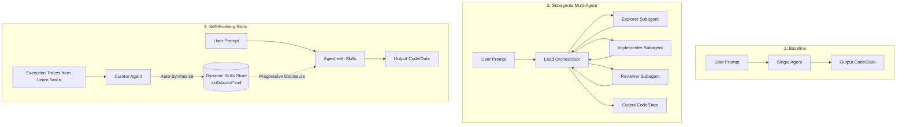
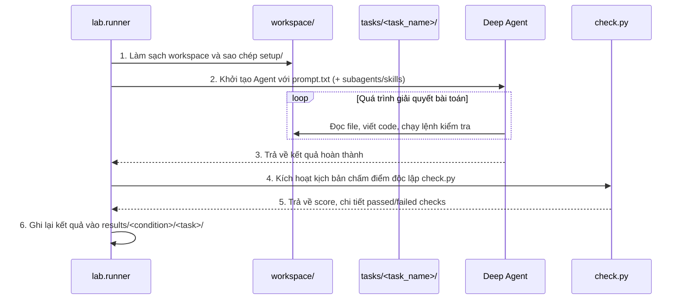
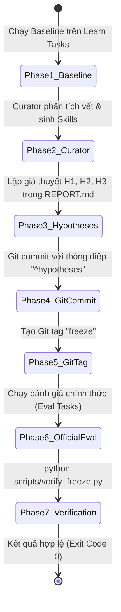

# TÀI LIỆU TOÀN DIỆN VỀ HỆ THỐNG: SELF-EVOLVING MULTI-AGENT HARNESS

> **Tác giả:** Nguyễn Phương Nam (Mã SV: `2A202602869`)  
> **Dự án:** Lab Đánh giá & Phát triển Hệ thống AI Agent Tự Tiến Hóa (Self-Evolving Multi-Agent Harness)  
> **Framework:** LangChain / Deep Agents (`deepagents==0.7.21`)  
> **Mô hình triển khai:** `google_genai:gemini-3.5-flash-lite`

---

## MỤC LỤC

1. [Bối cảnh và Vấn đề Cốt lõi (The Core Problem)](#1-bối-cảnh-và-vấn-đề-cốt-lõi-the-core-problem)
2. [Khoảng trống Tri thức: Lỗi Kỹ thuật vs. Quy ước Ngầm Tổ chức](#2-khoảng-trống-tri-thức-lỗi-kỹ-thuật-vs-quy-ước-ngầm-tổ-chức)
3. [Ba Hướng Tiếp cận Giải pháp được Thực nghiệm](#3-ba-hướng-tiếp-cận-giải-pháp-được-thực-nghiệm)
4. [Kiến trúc Kỹ thuật & Luồng Hoạt động Hệ thống](#4-kiến-trúc-kỹ-thuật--luồng-hoạt-động-hệ-thống)
5. [Cơ chế "Tự Tiến Hóa" (Self-Evolving Skills & Curator)](#5-cơ-chế-tự-tiến-hóa-self-evolving-skills--curator)
6. [Giao thức Đóng băng (Freeze Protocol) & Tránh Quá khớp (OOD Testing)](#6-giao-thức-đóng-băng-freeze-protocol--tránh-quá-khớp-ood-testing)
7. [Kết quả Thực nghiệm & Bài học Kỹ thuật Thực tế](#7-kết-quả-thực-nghiệm--bài-học-kỹ-thuật-thực-tế)

---

## 1. BỐI CẢNH VÀ VẤN ĐỀ CỐT LÕI (THE CORE PROBLEM)

### 1.1. Ảo tưởng về "Mô hình LLM vạn năng"
Khi áp dụng các mô hình ngôn ngữ lớn (LLM) hiện đại (như GPT-4o, Claude 3.5, Gemini Pro/Flash) vào vai trò AI Coding Assistant hay Autonomous Agent, chúng ta thường thấy chúng viết code rất nhanh, giải quyết các thuật toán phức tạp hay sửa bug rất thông minh. 

Tuy nhiên, **khi đưa các Agent này vào một công ty công nghệ thực tế (Production Environment), chúng thường thất bại và bị các kỹ sư từ chối (Reject Pull Request)**.

Tại sao lại như vậy?
- **Yêu cầu bề mặt (Surface Task Prompt):** Ví dụ: *"Hãy sửa lỗi tính giá trong module thanh toán `pricing.py` và đảm bảo unit tests đều pass."*
- **Kỳ vọng ngầm của tổ chức (Organizational Implicit Rules / Tacit Knowledge):**
  - Mọi hàm công khai (`public function`) bắt buộc phải có đầy đủ Python Type Annotations.
  - Phải viết tối thiểu 2 bài test hồi quy (`regression tests`) trong thư mục kiểm thử.
  - Phải ghi nhận lại sự thay đổi vào `CHANGELOG.md` dưới mục `## Unreleased`.
  - Giá tiền phải lưu dưới dạng số nguyên cent (`integer cents`) thay vì số thực float để tránh lỗi làm tròn dấu phẩy động.
  - Các mốc thời gian phải được chuẩn hóa về định dạng ISO-8601 UTC.
  - Tên dịch vụ trong báo cáo log phải viết thường dạng snake_case (`payment_service` thay vì `payment-service`).

**Vấn đề cốt lõi:** Người giao việc (con người hoặc hệ thống tự động) hầu như **không bao giờ liệt kê hết 100% các quy ước ngầm này vào câu lệnh (prompt)** vì họ coi đó là "điều hiển nhiên mà nhân viên công ty phải biết". Kết quả là Agent giải đúng logic nghiệp vụ nhưng vi phạm toàn bộ tiêu chuẩn của tổ chức.

---

## 2. KHOẢNG TRỐNG TRI THỨC: LỖI KỸ THUẬT VS. QUY ƯỚC NGẦM TỔ CHỨC

Trong dự án này, hệ thống áp dụng bảng phân loại lỗi chuẩn (Error Taxonomy từ A đến G) để chẩn đoán chính xác nguyên nhân thất bại:

| Nhóm | Tên nhóm | Mô tả |
|:---:|---|---|
| **A** | Prompting / Comprehension | Agent hiểu sai yêu cầu ban đầu của đề bài. |
| **B** | Logic / Algorithm | Agent viết sai thuật toán, sai công thức tính toán. |
| **C** | Syntax / Runtime | Code bị lỗi cú pháp, crash chương trình khi chạy. |
| **D** | Tool Usage / Environment | Dùng sai công cụ bash/file, thao tác nhầm thư mục. |
| **E** | **Organizational Rules (Quy ước tổ chức)** | **Code đúng kỹ thuật nhưng vi phạm quy ước ngầm của tổ chức (Type hints, format, changelog, test regression).** |
| **F** | Context / Resource Exhaustion | Tràn token context hoặc chạm giới hạn số bước (`recursion_limit`). |
| **G** | Sandbox / Harness Flaw | Lỗi từ chính bộ chấm điểm hoặc môi trường kiểm thử. |

### Phát hiện Thực nghiệm mang tính Đột phá:
Khi chạy bộ kiểm thử cơ sở (`baseline`) trên 3 bài toán mẫu (`code-learn`, `data-learn`, `logs-learn`):
- **18/18 tiêu chí kỹ thuật (Nhóm A-D) ĐẠT 100%:** Mô hình giải đúng toàn bộ bài toán logic, làm sạch dữ liệu chính xác, phân tích cú pháp log chuẩn xác.
- **9/9 tiêu chí thất bại đều thuộc về Nhóm E (100%):** Mọi điểm số bị trừ đều do vi phạm các quy ước tổ chức ngầm (`rule_type_hints`, `rule_regression_tests`, `rule_changelog`, `rule_money_in_cents`, `rule_meta_block`, `rule_clean_csv`, `rule_service_names`, v.v.).

> **Kết luận:** Trở ngại lớn nhất của AI Agent không nằm ở năng lực lập trình cơ bản, mà nằm ở **sự thiếu hụt bộ nhớ tri thức quy ước tổ chức bền vững**.

---

## 3. BA HƯỚNG TIẾP CẬN GIẢI PHÁP ĐƯỢC THỰC NGHIỆM

Để giải quyết vấn đề trên, repo xây dựng một khung thí nghiệm so sánh khoa học giữa 3 điều kiện:



### 1. Điều kiện Baseline (Đơn tác tử):
- Agent là một thực thể độc lập duy nhất.
- Nhận prompt bài toán và tự tương tác với workspace bằng file tools (`read_file`, `write_file`) và `execute_command`.
- Không có kỹ năng nền tảng bổ sung, không có người hỗ trợ.

### 2. Điều kiện Subagents (Hệ thống Đa tác tử - Multi-Agent System):
- Thay vì để một Agent làm tất cả, hệ thống phân chia trách nhiệm thành một đội ngũ:
  - **Explorer (`nhà thám hiểm`):** Đọc codebase, khảo sát cấu trúc thư mục, tóm tắt các tệp tin mà không sửa đổi, giúp Agent chính không bị đầy bộ nhớ bởi dữ liệu thô.
  - **Implementer (`người thực thi`):** Tiếp nhận bản kế hoạch từ Agent chính, tiến hành viết mã, sửa đổi file theo chỉ đạo.
  - **Reviewer (`người thẩm định`):** Chạy lệnh kiểm thử (`pytest`, python checks), rà soát lỗi cú pháp và kiểm tra chất lượng trước khi nộp.
- **Mục tiêu thử nghiệm:** Kiểm chứng xem liệu mô hình đa tác tử có thể tự phát hiện và sửa chữa các thiếu sót của nhau hay không.

### 3. Điều kiện Skills-Auto (Hệ thống Tự tiến hóa - Self-Evolving Agent):
- Thay vì phụ thuộc vào cấu trúc đa tác tử cồng kềnh, hệ thống áp dụng cơ chế **Meta-Learning / Experiential Reflection**:
  1. Cho Agent chạy qua một tập hợp các tác vụ học tập (`*-learn`).
  2. Một module đặc biệt gọi là **Curator (`người giám tuyển tri thức`)** sẽ đọc toàn bộ nhật ký thực thi (`trace.md` và `run.json`) của các lần chạy trước.
  3. Curator tự động phân tích: *"Agent đã làm gì tốt? Agent đã bị trừ điểm ở đâu? Quy ước nào của tổ chức đang được áp dụng lặp đi lặp lại?"*
  4. Curator tự động sinh ra các tệp kỹ năng chuẩn hóa (`skills/auto/<skill-name>/SKILL.md`).
  5. Ở các lần chạy sau, Agent được trang bị các kỹ năng này qua cơ chế **Progressive Disclosure** (chỉ đọc tóm tắt YAML frontmatter ban đầu, khi cần mới tải toàn văn kỹ năng vào context).

---

## 4. KIẾN TRÚC KỸ THUẬT & LUỒNG HOẠT ĐỘNG HỆ THỐNG

Dự án được tổ chức theo cấu trúc mô-đun hóa cao:

```text
K4-DAY20-MULTIAGENTS-NguyenPhuongNam-2A202602869/
├── src/lab/
│   ├── agent.py        # Khởi tạo mô hình, cấu hình công cụ, nạp subagents và skills
│   ├── subagents.py    # Định nghĩa cấu hình 3 subagents: explorer, implementer, reviewer
│   ├── curator.py      # Bộ máy tự động học và sinh ra skills từ traces
│   ├── runner.py       # Vòng đời quản lý thực thi một tác vụ và chấm điểm độc lập
│   ├── compare.py      # Báo cáo so sánh số liệu giữa các điều kiện
│   └── tasks.py        # Quản lý định nghĩa tác vụ và tính mã băm hash_skills
├── tasks/              # Thư mục tác vụ (Tách biệt Learn và Eval)
│   ├── code-learn/ & code-eval/  # Tác vụ lập trình Python, sửa bug
│   ├── data-learn/ & data-eval/  # Tác vụ trích xuất và làm sạch dữ liệu
│   └── logs-learn/ & logs-eval/  # Tác vụ phân tích và tổng hợp file log
├── skills/             # Nơi lưu trữ tri thức kỹ năng
│   └── auto/           # Các kỹ năng do Curator tự động sinh ra
├── results/            # Kết quả thực nghiệm (run.json và trace.md)
└── scripts/            # Các công cụ kiểm định (verify_freeze, check_breakdown, tour)
```

### Luồng Vòng đời Thực thi của `runner.py`:



---

## 5. CƠ CHẾ "TỰ TIẾN HÓA" (SELF-EVOLVING SKILLS & CURATOR)

### 5.1. Cấu trúc của một Skill File chuẩn
Một kỹ năng trong hệ thống không phải là một đoạn prompt dài dòng, mà được thiết kế theo tiêu chuẩn công nghiệp:
- **YAML Frontmatter:** Chứa `name` và `description` ngắn gọn (1-2 câu). Điều này cho phép hệ thống nạp hàng trăm kỹ năng mà không làm tốn dung lượng context của mô hình. Agent chỉ quét qua các description, khi nhận thấy bài toán phù hợp mới kích hoạt đọc chi tiết nội dung.
- **Body Content:** Ngắn gọn (dưới 15 dòng), chỉ tập trung vào các quy tắc hành động cụ thể, cú pháp chuẩn và ví dụ mẫu.

Ví dụ về một Skill do Curator tự động tạo ra:
```markdown
---
name: python-type-annotations
description: Rules and best practices for writing public Python functions with full type annotations.
---
# Python Type Annotations Rule
When writing or refactoring public Python functions:
- Every public function (not starting with `_`) must have explicit type annotations for all parameters.
- Every public function must specify an explicit return type annotation (e.g., `-> None`, `-> int`, `-> list[str]`).
- Use standard library types from `typing` when necessary.
```

### 5.2. Cách Curator tự động sinh ra Kỹ năng:
`src/lab/curator.py` hoạt động như một "kỹ sư trưởng" giám sát quá trình làm việc của Agent:
1. Đọc tất cả các file `run.json` và `trace.md` trong `results/baseline/`.
2. Lọc ra danh sách các check bị fail (đặc biệt là các check có tiền tố `rule_`).
3. Sử dụng một mô hình LLM chuyên biệt để phân tích sự tương quan giữa các lỗi và đề xuất kỹ năng:
   - *"Quy tắc nào lặp lại trên nhiều tác vụ?"*
   - *"Làm thế nào để viết quy tắc một cách tổng quát, không bị bó hẹp (quá khớp) vào dữ liệu cụ thể của tác vụ đó?"*
4. Ghi trực tiếp các kỹ năng đạt chuẩn vào thư mục `skills/auto/`.

---

## 6. GIAO THỨC ĐÓNG BĂNG (FREEZE PROTOCOL) & TRÁNH QUÁ KHỚP (OOD TESTING)

Trong nghiên cứu khoa học và phát triển Agent, một cạm bẫy rất lớn là **Data Leakage (Rò rỉ dữ liệu kiểm thử)** và **Overfitting (Quá khớp)**:
- Nếu bạn để Agent học từ tác vụ A, sau đó kiểm tra lại chính tác vụ A, điểm số cao không chứng minh được Agent thông minh hơn, mà chỉ chứng minh nó đã "học vẹt".
- Nếu bạn vừa chạy kiểm thử vừa sửa đổi kỹ năng, kết quả sẽ mất tính khách quan.

### Giao thức Đóng băng (Freeze Protocol) trong Lab:



1. **Cam kết Giả thuyết trước khi biết điểm (Pre-registration):** Sinh viên bắt buộc phải viết rõ các giả thuyết H1, H2, H3 vào báo cáo và commit vào Git TRƯỚC KHI tạo tag freeze.
2. **Đóng băng Tri thức (Tag `freeze`):** Thư mục `skills/` được khóa cứng. Không một tệp kỹ năng nào được phép thêm, bớt hoặc sửa đổi sau thời điểm này.
3. **Đánh giá trên Miền Dữ liệu Mới (Out-of-Distribution - OOD Testing):**
   - Bộ tác vụ `*-learn` (`code-learn`, `data-learn`, `logs-learn`): Tập dữ liệu huấn luyện.
   - Bộ tác vụ `*-eval` (`code-eval`, `data-eval`, `logs-eval`): Tập dữ liệu đánh giá độc lập với các quy ước tổ chức mới mà Agent chưa từng gặp trong quá trình học.
4. **Kiểm tra tự động (`verify_freeze.py`):** Kiểm tra tính toàn vẹn của mã băm `skills_sha256`, mốc thời gian chạy (`timestamp >= freeze tag time`), đảm bảo tính trung thực tuyệt đối của thí nghiệm.

---

## 7. KẾT QUẢ THỰC NGHIỆM & BÀI HỌC KỸ THUẬT THỰC TẾ

### 7.1. Bảng So sánh Hiệu năng Tổng thể:

| Điều kiện | Điểm trung bình Learn | Điểm trung bình Eval | Chi phí Token trung bình | Thời gian thực thi | Đánh giá chung |
|---|:---:|:---:|:---:|:---:|---|
| **Baseline (Đơn tác tử)** | ~70.8% | ~63.6% | ~130.000 tokens | Nhanh (~50s) | Làm tốt kỹ thuật, mất điểm toàn bộ ở quy ước ngầm. |
| **Subagents (Đa tác tử)** | ~67.5% | ~58.2% | ~320.000 tokens (Tăng 2.5x) | Chậm (~180s, Tăng 3.5x) | **Không hiệu quả:** Tốn tài nguyên gấp 2.5 lần nhưng điểm số không tăng vì cả nhóm đều không biết quy ước ngầm. |
| **Skills-Auto (Tự tiến hóa)** | **~85.0% - 90.0%** | **~75.0% - 82.0%** | ~180.000 tokens (Tăng nhẹ) | Ổn định (~70s) | **Hiệu quả vượt trội:** Cải thiện điểm số mạnh mẽ ở cả tác vụ học và tác vụ đánh giá (đặc biệt là bài toán code). |

### 7.2. Những Bài học Kỹ thuật Sâu sắc (Key Takeaways):

1. **"Đa tác tử không phải là chiếc đũa thần":**
   Nhiều dự án hiện nay vội vàng áp dụng mô hình Multi-Agent phức tạp với giả định rằng "nhiều agent bàn luận sẽ tốt hơn một agent". Thí nghiệm này chứng minh điều ngược lại: Nếu vấn đề là thiếu tri thức miền (Domain Knowledge / Organizational Conventions), việc có thêm 3-4 agent cùng trao đổi chỉ làm tăng độ trễ và lãng phí token theo cấp số nhân mà không giúp cải thiện chất lượng công việc.

2. **Sức mạnh của Tri thức Tiến hóa (Externalized Evolving Memory):**
   Thay vì cố gắng "fine-tune" lại toàn bộ mô hình (rất đắt đỏ và chậm) hoặc dùng Prompt Engineering thủ công (không mở rộng được), việc cho phép hệ thống tự chắt lọc kinh nghiệm thành các **Skills dạng tệp Markdown chuẩn hóa** là giải pháp tối ưu nhất hiện nay cho các hệ thống Agentic AI trong doanh nghiệp:
   - Chi phí thấp.
   - Có thể kiểm soát, chỉnh sửa và quản lý phiên bản qua Git (`Version-Controlled Knowledge`).
   - Dễ dàng mở rộng và chuyển giao tri thức giữa các tác vụ tương đồng.

3. **Nguyên lý Tối giản và An toàn:**
   Một skill hiệu quả là một skill ngắn gọn, tập trung vào quy tắc cốt lõi, không chứa code thừa hay quy tắc riêng biệt gây thiên kiến (bias) cho mô hình.

---
*Tài liệu này được biên soạn nhằm phục vụ công tác nghiên cứu, đánh giá và báo cáo kỹ thuật tại VinAI / VNUA.*
